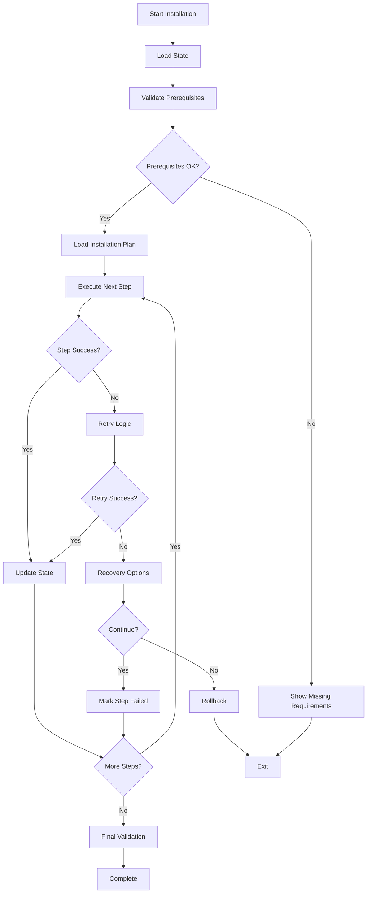

# Design Document

## Overview

The resilient installation system transforms the existing monolithic install.sh script into a modular, fault-tolerant installation framework. The design introduces state management, retry mechanisms, validation systems, and recovery capabilities while maintaining the simplicity and effectiveness of the current installation process.

## Architecture

### Core Components

```
Resilient Installation System
├── Installation Controller (install.sh)
├── State Manager (lib/state.sh)
├── Step Executor (lib/executor.sh)
├── Validation Engine (lib/validator.sh)
├── Recovery Manager (lib/recovery.sh)
├── Progress Tracker (lib/progress.sh)
└── Installation Steps (steps/*.sh)
```

### Installation Flow



## Components and Interfaces

### State Manager (lib/state.sh)

Manages installation progress and system state persistence.

**Key Functions:**

- `save_state(step_id, status, metadata)` - Persists step completion status
- `load_state()` - Loads existing installation state
- `reset_state()` - Clears all progress for fresh installation
- `get_step_status(step_id)` - Returns status of specific step
- `backup_file(filepath)` - Creates timestamped backup of existing files

**State File Format:**

```json
{
  "installation_id": "uuid",
  "started_at": "timestamp",
  "last_updated": "timestamp",
  "steps": {
    "step_id": {
      "status": "completed|failed|skipped",
      "completed_at": "timestamp",
      "attempts": 2,
      "metadata": {}
    }
  },
  "backups": {
    "filepath": "backup_location"
  }
}
```

### Step Executor (lib/executor.sh)

Handles execution of individual installation steps with retry logic and error handling.

**Key Functions:**

- `execute_step(step_id, step_function)` - Executes a step with full error handling
- `retry_with_backoff(command, max_attempts)` - Implements exponential backoff retry
- `check_network_connectivity()` - Validates internet connection
- `run_with_timeout(command, timeout)` - Executes commands with timeout protection

**Retry Strategy:**

- Network operations: 3 attempts with exponential backoff (1s, 2s, 4s)
- File operations: 2 attempts with 1s delay
- Package installations: 2 attempts with dependency check

### Validation Engine (lib/validator.sh)

Provides comprehensive validation of system state and installation completeness.

**Key Functions:**

- `validate_prerequisites()` - Checks system requirements before installation
- `validate_step(step_id)` - Validates specific step completion
- `validate_full_installation()` - Comprehensive system validation
- `check_tool_functionality(tool_name)` - Verifies tool is working correctly
- `validate_symlinks()` - Ensures all symlinks are valid

**Validation Categories:**

- System prerequisites (macOS version, disk space, permissions)
- Tool availability and functionality
- Configuration file integrity
- Symlink validity
- Network connectivity for required services

### Recovery Manager (lib/recovery.sh)

Handles rollback operations and system recovery from failed installations.

**Key Functions:**

- `rollback_step(step_id)` - Undoes changes from specific step
- `rollback_session()` - Rolls back all changes from current session
- `restore_backups()` - Restores backed-up configuration files
- `cleanup_partial_installations()` - Removes incomplete installations

### Progress Tracker (lib/progress.sh)

Provides user feedback and progress visualization during installation.

**Key Functions:**

- `show_progress()` - Displays current progress and remaining steps
- `estimate_time_remaining()` - Calculates ETA based on step durations
- `log_operation(message, level)` - Logs operations to file and console
- `show_step_details(step_id)` - Displays detailed step information

## Data Models

### Installation Step Definition

```bash
# steps/homebrew.sh
STEP_ID="homebrew"
STEP_NAME="Install Homebrew and Packages"
STEP_DESCRIPTION="Installs Homebrew package manager and all required packages"
STEP_DEPENDENCIES=("xcode_tools")
STEP_ESTIMATED_TIME=300  # seconds
STEP_CATEGORY="package_management"
STEP_CRITICAL=true  # If true, failure triggers rollback

execute_homebrew_step() {
    # Step implementation
}

validate_homebrew_step() {
    # Step validation
}

rollback_homebrew_step() {
    # Step rollback
}
```

### Installation Plan

```bash
# Installation steps in dependency order
INSTALLATION_STEPS=(
    "prerequisites"
    "xcode_tools"
    "ssh_setup"
    "github_auth"
    "clone_dotfiles"
    "clone_repos"
    "homebrew"
    "rust"
    "nodejs"
    "global_packages"
    "configurations"
    "symlinks"
    "final_validation"
)
```

## Error Handling

### Error Classification

1. **Recoverable Errors**: Network timeouts, temporary file locks, package download failures
2. **User Errors**: Missing prerequisites, authentication failures, permission issues
3. **System Errors**: Disk space, incompatible macOS version, corrupted downloads
4. **Critical Errors**: System corruption, security violations, dependency conflicts

### Error Response Strategy

```bash
handle_error() {
    local error_type=$1
    local error_message=$2
    local step_id=$3

    case $error_type in
        "network")
            retry_with_backoff "$step_id" 3
            ;;
        "permission")
            prompt_for_sudo_and_retry "$step_id"
            ;;
        "dependency")
            install_missing_dependency_and_retry "$step_id"
            ;;
        "critical")
            trigger_rollback "$step_id"
            ;;
    esac
}
```

## Testing Strategy

### Unit Testing

- Individual function testing using `bats` (Bash Automated Testing System)
- Mock external dependencies (network calls, file operations)
- Test error conditions and edge cases
- Validate state management operations

### Integration Testing

- Full installation testing in clean macOS environments
- Test resume functionality after simulated failures
- Validate rollback operations
- Test installation on different macOS versions

### Validation Testing

- Verify all installed tools function correctly
- Test symlink integrity
- Validate configuration file correctness
- Ensure development environment is fully functional

### Test Environments

1. **Clean macOS VM**: Fresh installation testing
2. **Partially Configured System**: Resume and conflict handling
3. **Network-Limited Environment**: Offline capability testing
4. **Low-Resource System**: Performance and resource usage testing

## Implementation Phases

### Phase 1: Core Infrastructure

- State management system
- Step executor with basic retry logic
- Progress tracking and logging
- Modular step structure

### Phase 2: Enhanced Resilience

- Advanced retry mechanisms
- Network failure handling
- Validation engine
- Recovery and rollback systems

### Phase 3: User Experience

- Interactive progress display
- Detailed error reporting
- Selective installation options
- Comprehensive validation reporting

### Phase 4: Testing and Optimization

- Comprehensive test suite
- Performance optimization
- Documentation and examples
- CI/CD integration for testing
