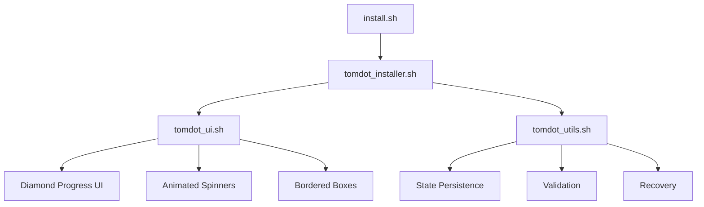

# Design Document

## Overview

The tomdot refactor transforms the current file-proliferated codebase into a clean, maintainable architecture while preserving the perfected Rock.js-inspired CLI styling. The design consolidates resilient installation functionality into a focused production system that enhances the existing install.sh with beautiful UI and robust error handling.

## Architecture

### High-Level Architecture

```
tomdot/
├── install.sh                    # Enhanced main entry point
├── lib/
│   ├── tomdot_installer.sh      # Core installation engine
│   ├── tomdot_ui.sh            # Rock.js-inspired CLI framework
│   └── tomdot_utils.sh         # Consolidated helper utilities
├── [existing dotfiles structure] # Preserved as-is
└── [cleanup: remove experimental files]
```

### Component Interaction Flow



## Components and Interfaces

### 1. Enhanced install.sh (Main Entry Point)

**Purpose:** Maintains backward compatibility while orchestrating the enhanced installation flow.

**Key Functions:**

- Validates macOS environment
- Sources the tomdot_installer.sh library
- Initiates installation with UI framework
- Handles command-line arguments for individual steps

**Interface:**

```bash
# Entry points
curl -ssL https://git.io/tomdot | sh    # Full installation
./install.sh --step ssh                # Individual step
./install.sh --resume                  # Resume from failure
```

### 2. tomdot_installer.sh (Installation Engine)

**Purpose:** Core resilient installation functionality with state management.

**Key Functions:**

```bash
install_ssh_setup()           # SSH key generation and GitHub auth
install_homebrew()           # Homebrew installation with retry logic
install_packages()           # Package installation from Brewfile
install_languages()          # Node.js, Rust toolchain setup
create_symlinks()           # Dotfiles symlink creation
apply_macos_settings()      # System preferences (optional)
```

**State Management:**

- Persistent state file: `~/.tomdot_install_state`
- Step completion tracking
- Failure point recording for resume capability

**Error Handling:**

- Network retry logic with exponential backoff
- Validation after each step
- Rollback capability for failed operations

### 3. tomdot_ui.sh (CLI Framework)

**Purpose:** Rock.js-inspired beautiful CLI interface exactly matching simple_rock_demo.sh aesthetics.

**Visual Components:**

```bash
ui_start_section()          # ◇ Section headers with connecting lines
ui_progress_step()          # │ Step progress with diamond bullets
ui_spinner_start()          # Animated spinner (enhanced from static "...")
ui_spinner_stop()           # Stop spinner with success/failure
ui_bordered_box()           # Next steps display in bordered box
ui_question()               # Interactive prompts with styling
```

**Visual Specifications:**

- Diamond symbols (◇) for section headers
- Connecting lines (│) for visual flow
- Consistent color scheme matching Rock.js
- Animated spinners for long operations
- Bordered boxes for important information

### 4. tomdot_utils.sh (Helper Utilities)

**Purpose:** Consolidated utility functions from existing lib/ files.

**Key Functions:**

```bash
validate_installation()     # Verify successful setup
backup_existing_config()   # Safe backup before changes
detect_conflicts()         # Configuration conflict detection
resolve_conflicts()        # Interactive conflict resolution
log_operation()            # Structured logging
check_prerequisites()      # System requirement validation
```

## Data Models

### Installation State Schema

```json
{
  "version": "1.0",
  "started_at": "2024-01-01T12:00:00Z",
  "current_step": "homebrew",
  "completed_steps": ["ssh_setup"],
  "failed_steps": [],
  "backups": {
    "gitconfig": "~/.gitconfig.backup.20240101",
    "zshrc": "~/.zshrc.backup.20240101"
  },
  "configuration": {
    "skip_macos_settings": false,
    "github_username": "tomhendra"
  }
}
```

### Step Definition Schema

```bash
# Each installation step follows this pattern
declare -A STEP_SSH_SETUP=(
  [name]="SSH Setup"
  [description]="Generate SSH keys and authenticate with GitHub"
  [prerequisites]="internet_connection"
  [validation]="validate_ssh_setup"
  [rollback]="rollback_ssh_setup"
  [retry_count]=3
)
```

## Error Handling

### Retry Strategy

1. **Network Operations:** Exponential backoff (1s, 2s, 4s, 8s)
2. **File Operations:** Immediate retry with permission check
3. **Package Installation:** Homebrew-specific retry logic
4. **User Input:** Validation with re-prompt capability

### Recovery Mechanisms

1. **State Persistence:** Save progress after each successful step
2. **Backup Creation:** Automatic backup of existing configurations
3. **Rollback Capability:** Undo changes on critical failures
4. **Resume Functionality:** Continue from last successful step

### Failure Scenarios

```bash
# Example error handling flow
install_step() {
  local step_name="$1"

  ui_start_section "$step_name"
  ui_spinner_start "Installing $step_name"

  if ! execute_step "$step_name"; then
    ui_spinner_stop "failed"
    log_operation "ERROR" "$step_name failed"

    if should_retry "$step_name"; then
      retry_step "$step_name"
    else
      offer_recovery_options "$step_name"
    fi
  else
    ui_spinner_stop "success"
    mark_step_complete "$step_name"
  fi
}
```

## Testing Strategy

### Unit Testing Approach

**Test Framework:** bats (Bash Automated Testing System)

**Test Categories:**

1. **UI Component Tests:** Verify visual output matches expected format
2. **Installation Logic Tests:** Mock external dependencies, test flow
3. **State Management Tests:** Validate persistence and recovery
4. **Utility Function Tests:** Test validation, backup, and conflict resolution

**Test Structure:**

```
tests/
├── test_ui_components.bats      # CLI framework visual tests
├── test_installation_flow.bats  # Installation engine tests
├── test_state_management.bats   # State persistence tests
├── test_utilities.bats          # Helper function tests
└── fixtures/                    # Test data and mocks
```

### Integration Testing

**Approach:** Docker-based macOS simulation for safe testing

**Test Scenarios:**

1. Fresh installation on clean macOS
2. Installation with existing configurations
3. Resume after network failure
4. Resume after partial completion
5. Rollback after critical failure

### Manual Testing Checklist

1. **Visual Verification:** CLI output matches Rock.js aesthetics exactly
2. **Installation Completeness:** All dotfiles and tools properly installed
3. **Error Recovery:** Graceful handling of common failure scenarios
4. **Backward Compatibility:** Existing workflows continue to function

## Implementation Phases

### Phase 1: Core Framework Setup

- Create lib/ directory structure
- Implement tomdot_ui.sh with exact Rock.js styling
- Basic tomdot_installer.sh structure
- Enhanced install.sh orchestration

### Phase 2: Installation Engine

- Implement all installation steps with retry logic
- Add state persistence and resume capability
- Integrate backup and rollback mechanisms
- Comprehensive error handling

### Phase 3: Utility Consolidation

- Migrate useful functions from existing lib/ files
- Implement validation and conflict resolution
- Add comprehensive logging
- Remove duplicate and experimental files

### Phase 4: Testing and Validation

- Implement bats test suite
- Docker-based integration testing
- Manual testing on fresh macOS installations
- Performance optimization and cleanup

## File Cleanup Strategy

### Files to Remove

- All experimental and demo files not serving production
- Duplicate functionality across multiple lib/ files
- Temporary development artifacts
- Unused configuration templates

### Files to Preserve

- All existing dotfiles structure (zsh/, git/, ghostty/, etc.)
- Brewfile and package definitions
- README.md and documentation
- Working configuration files

### Migration Strategy

- Extract useful functions before deletion
- Maintain git history for important changes
- Document any breaking changes
- Provide migration guide if needed
